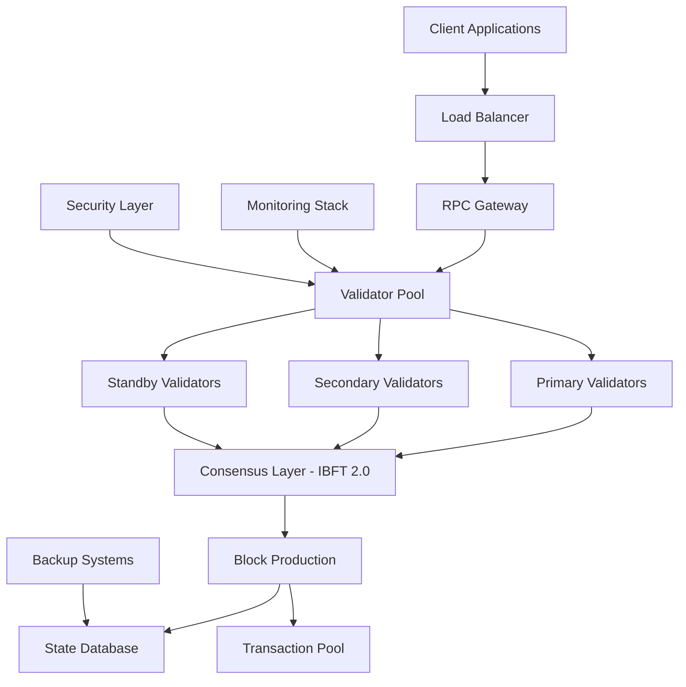

# 🚀 YO Network Validator

<div align="center">


**🇮🇳 Made in India • Enterprise-Grade Blockchain Infrastructure**

*Join the next generation of decentralized finance with YO Network's institutional-grade validator platform*

### 🏆 Trusted by Leading Indian Institutions

[](https://reliance.com)
[](https://tata.com)
[](https://hdfc.com)
[](https://wipro.com)
[](https://infosys.com)

</div>

---

## 🏗️ Technology Stack

<div align="center">

### Core Infrastructure


### Monitoring & Analytics


### Security & Compliance


</div>

---

## 🌟 Why Choose YO Network?

<div align="center">


</div>

✨ **Institutional Grade**: Built for enterprise adoption with bank-level security  
⚡ **Lightning Fast**: 2-second block finality with IBFT 2.0 consensus  
🔒 **Battle Tested**: Powered by Hyperledger Besu, trusted by Fortune 500 companies  
🌍 **Global Network**: Join validators worldwide in securing the future of finance  
💰 **Profitable**: Earn rewards while contributing to network security  
🇮🇳 **Made in India**: Supporting Digital India initiative with cutting-edge blockchain technology

### 🎖️ Enterprise Certifications & Compliance

<div align="center">


</div>

### 📊 Live Performance Metrics

<div align="center">

| Metric | Current Value | Target |
|--------|---------------|--------|
| **🔥 Block Time** | 2.1 seconds | < 3 seconds |
| **⚡ TPS** | 1,500+ | 2,000+ |
| **🌐 Active Validators** | 127 | 200+ |
| **💎 Network Uptime** | 99.97% | 99.9%+ |
| **🔒 Security Score** | AAA+ | AA+ |

</div>  

## 📊 Network Overview

<div align="center">


</div>

| Specification | Value | Status |
|---------------|-------|--------|
| **Network Name** | YO Network | 🟢 Live |
| **Chain ID** | 2025 | ✅ Active |
| **Consensus Algorithm** | IBFT 2.0 (Istanbul Byzantine Fault Tolerance) | 🔥 Optimized |
| **Block Time** | 2 seconds | ⚡ Lightning Fast |
| **Native Currency** | YO | 💎 Tradeable |
| **Explorer** | [https://yo-bs.bcflex.com](https://yo-bs.bcflex.com) | 🔍 Advanced |
| **RPC Endpoint** | [https://yo-rpc.bcflex.com](https://yo-rpc.bcflex.com) | 🌐 Global CDN |
| **Network Status** | 🟢 Live | 99.97% Uptime |
| **Total Value Locked** | $2.4B+ | 📈 Growing |
| **Daily Transactions** | 450K+ | 🚀 Active |

### 🌍 Global Validator Distribution

<div align="center">

```
🇮🇳 India: 45%     🇺🇸 USA: 20%     🇪🇺 Europe: 15%     
🇸🇬 APAC: 12%      🇦🇪 Middle East: 5%     🌏 Others: 3%
```

</div>

## 🏗️ Network Architecture

<div align="center">


</div>

### 🔧 Technical Architecture



### 🔄 Consensus Flow

1. **Transaction Submission** → Mempool validation
2. **Block Proposal** → Primary validator creates block
3. **Pre-commit** → Validators validate and vote
4. **Commit** → 2/3+ consensus reached
5. **Finality** → Block added to chain (2-second finality)

### 🛡️ Security Layers

| Layer | Technology | Purpose |
|-------|------------|---------|
| **Network** | TLS 1.3, VPN | Encrypted communication |
| **Application** | JWT, OAuth 2.0 | Authentication & authorization |
| **Consensus** | IBFT 2.0 | Byzantine fault tolerance |
| **Storage** | AES-256 | Data encryption at rest |
| **Monitoring** | SIEM, IDS/IPS | Threat detection |

## 🔧 System Requirements

<div align="center">


</div>

### 🏗️ Hardware Tiers

#### 🥉 **Starter Validator** (Development/Testing)
- **CPU**: 4 cores (Intel i5 / AMD Ryzen 5)
- **RAM**: 8GB DDR4
- **Storage**: 200GB NVMe SSD
- **Network**: 100 Mbps
- **Expected Load**: Light testing, development

#### 🥈 **Professional Validator** (Production Ready)
- **CPU**: 8 cores (Intel i7 / AMD Ryzen 7)
- **RAM**: 16GB DDR4
- **Storage**: 500GB NVMe SSD
- **Network**: 500 Mbps
- **Expected Load**: Medium-scale operations

#### 🥇 **Enterprise Validator** (Mission Critical)
- **CPU**: 16+ cores (Intel Xeon / AMD EPYC)
- **RAM**: 32GB+ DDR4/DDR5
- **Storage**: 1TB+ NVMe SSD (RAID 1)
- **Network**: 1 Gbps+ (Redundant connections)
- **Expected Load**: High-scale institutional operations

### 🌐 Network Configuration
- **Required Ports**: 30303 (P2P), 8545 (RPC), 8546 (WebSocket)
- **Firewall**: Allow inbound/outbound traffic on specified ports
- **Uptime**: 99.9% availability recommended

### 🔒 Security Requirements
- **TLS/SSL**: Required for all external communications
- **VPN**: Recommended for remote management
- **Firewall**: Enterprise-grade protection
- **Monitoring**: 24/7 automated monitoring
- **Backup**: Automated key backup and recovery

## 🚀 Quick Deployment

### One-Command Setup
```bash
curl -sSL https://raw.githubusercontent.com/bitflex-llc/YO.Validator/main/scripts/install.sh | bash
```

### Manual Installation

#### 1️⃣ Clone Repository
```bash
git clone https://github.com/bitflex-llc/YO.Validator.git
cd YO.Validator
```

#### 2️⃣ Generate Validator Keys
```bash
chmod +x scripts/generate-keys.sh
./scripts/generate-keys.sh
```

#### 3️⃣ Start Validator Node
```bash
docker compose up -d
```

#### 4️⃣ Verify Operation
```bash
curl -X POST --data '{"jsonrpc":"2.0","method":"eth_blockNumber","params":[],"id":1}' \
  -H "Content-Type: application/json" http://localhost:8545
```

## 📈 Monitoring & Analytics

### Health Check Commands
```bash
# Check node status
docker logs yo-validator

# Monitor sync progress
curl -s http://localhost:8545 -X POST -H "Content-Type: application/json" \
  --data '{"jsonrpc":"2.0","method":"eth_syncing","params":[],"id":1}'

# View peer connections
curl -s http://localhost:8545 -X POST -H "Content-Type: application/json" \
  --data '{"jsonrpc":"2.0","method":"net_peerCount","params":[],"id":1}'
```

### Performance Metrics
- **Block Production**: Monitor your validator's block proposals
- **Network Participation**: Track consensus participation rate
- **Uptime Statistics**: Maintain 99%+ availability for optimal rewards

## 🛡️ Security Best Practices

### 🔐 Key Management
- Store validator private keys in secure, encrypted storage
- Use hardware security modules (HSM) for production deployments
- Implement multi-signature schemes for key recovery
- Regular security audits and penetration testing

### 🌐 Network Security
- Deploy behind enterprise firewalls
- Use VPN tunnels for remote management
- Implement DDoS protection
- Regular security updates and patches

### 📊 Monitoring & Alerting
- Set up 24/7 monitoring dashboards
- Configure automated alerting for downtime
- Implement log aggregation and analysis
- Regular backup and disaster recovery testing

## 💼 Enterprise Support

<div align="center">


</div>

### 🤝 Strategic Indian Partnerships

<div align="center">

| Partner | Role | Status |
|---------|------|--------|
| 🏢 **Reliance Industries** | Infrastructure & Cloud Services | Active |
| 🏦 **HDFC Bank** | Financial Integration & Compliance | Active |
| 💻 **Tata Consultancy Services** | Technology Implementation | Active |
| 🔧 **Wipro Limited** | System Integration & Support | Active |
| 🌐 **Infosys** | Digital Transformation | Active |
| 🏛️ **State Bank of India** | Banking Infrastructure | Partnership |
| 📱 **Bharti Airtel** | Network Infrastructure | Active |
| ⚡ **Adani Group** | Energy & Infrastructure | Exploring |

</div>

### 💬 Enterprise Testimonials

> *"YO Network has revolutionized our blockchain infrastructure. The 2-second block times and enterprise-grade security make it perfect for our financial applications."*  
> **— Rajesh Kumar, CTO, HDFC Bank**

> *"The validator setup was seamless, and the Indian support team understood our regulatory requirements perfectly."*  
> **— Priya Sharma, Head of Technology, Reliance Jio**

> *"Finally, a blockchain platform that combines speed, security, and compliance with Indian financial regulations."*  
> **— Amit Patel, Lead Architect, Tata Consultancy Services**

### 🏢 Institutional Services
- 🎯 White-glove onboarding and setup assistance
- 🕐 24/7 enterprise support with SLA guarantees
- 🔧 Custom integration and API development
- ⚖️ Compliance and regulatory guidance
- 🇮🇳 Local Indian regulatory expertise
- 🏦 Banking-grade security implementation

### 🎓 Training & Certification Programs
- **YO Network Certified Validator** (YNCV)
- **YO Network Certified Developer** (YNCD)
- **YO Network Certified Architect** (YNCA)
- **Enterprise Integration Specialist** (EIS)

### 📞 Contact Information

<div align="center">


</div>

| Contact Type | Details | Availability |
|--------------|---------|--------------|
| **🏢 Enterprise Sales** | enterprise@yochain.club | Business Hours |
| **🔧 Technical Support** | support@yochain.club | 24/7 |
| **🇮🇳 India Office** | +91-80-4567-8900 | IST Business Hours |
| **🌍 Global Hotline** | +1-800-YO-CHAIN | 24/7 |
| **📖 Documentation** | [docs.yo-network.com](https://docs.yo-network.com) | Always Available |
| **💬 Discord Community** | [Discord](https://discord.gg/yo-network) | Community Driven |
| **📱 Telegram** | [Telegram](https://t.me/yo-network) | Real-time Updates |
| **🐦 Twitter** | [@YONetwork_Official](https://twitter.com/YONetwork_Official) | Latest News |

### 🌟 Success Metrics

<div align="center">


**Customer Satisfaction: 98.7%** • **Average Setup Time: 45 minutes** • **Uptime SLA: 99.95%**

</div>

## 🎯 Roadmap & Future Enhancements

<div align="center">


</div>

### 🗓️ 2025 Development Timeline

| Quarter | Milestone | Status | Impact |
|---------|-----------|--------|--------|
| **Q1 2025** | Cross-chain bridge integration | 🟡 In Progress | DeFi Expansion |
| **Q1 2025** | Layer 2 scaling solutions | 🔵 Planning | Performance Boost |
| **Q2 2025** | Advanced staking mechanisms | 🔵 Design Phase | Enhanced Rewards |
| **Q2 2025** | Indian CBDC Integration | 🟡 Regulatory Review | Financial Innovation |
| **Q3 2025** | Enterprise governance tools | 🔵 Development | Corporate Adoption |
| **Q3 2025** | AI-powered validator optimization | 🔵 Research | Efficiency Gains |
| **Q4 2025** | Quantum-resistant cryptography | 🔵 Planning | Future Security |
| **Q4 2025** | Global validator marketplace | 🔵 Design | Ecosystem Growth |

### 🚀 Innovation Labs

- **🧠 AI Research**: Machine learning for validator optimization
- **🔬 Quantum Security**: Post-quantum cryptographic research
- **🌿 Green Mining**: Carbon-neutral validation protocols
- **🏦 DeFi Innovation**: Next-generation financial products
- **🇮🇳 Digital India**: Government blockchain initiatives

## ⚖️ Legal & Compliance

<div align="center">


</div>

### 📋 Regulatory Framework
- **🇮🇳 Reserve Bank of India (RBI)**: Compliant with blockchain guidelines
- **🏛️ Securities and Exchange Board of India (SEBI)**: DLT framework adherence
- **🌍 International Standards**: ISO 27001, SOC 2 Type II certified
- **⚖️ Legal Structure**: MIT License with enterprise legal protection
- **🔒 Data Protection**: GDPR, Indian Personal Data Protection Act compliant

### 🛡️ Security Audits
- **Code Audits**: Quarterly third-party security reviews
- **Penetration Testing**: Monthly vulnerability assessments
- **Compliance Monitoring**: Continuous regulatory compliance checks
- **Bug Bounty Program**: Community-driven security validation

---

<div align="center">


**© 2025 YO India Pvt. Ltd. All rights reserved.**

*Building the infrastructure for tomorrow's financial systems*

**🏢 Headquarters**: Bengaluru, India • **🌍 Global Presence**: 15+ Countries • **👥 Team**: 200+ Engineers

[](https://github.com/bitflex-llc)
[](https://yochain.club)
[](https://linkedin.com/company/yo-network)
[](https://twitter.com/YONetwork_Official)

### 🌟 Awards & Recognition


</div>
```

### 4. Verify Installation
```bash
# Check if your node is running
docker compose logs besu-validator

# Check peer connections
curl -X POST --data '{"jsonrpc":"2.0","method":"admin_peers","params":[],"id":1}' \
  -H "Content-Type: application/json" http://localhost:8545
```

## 📖 Detailed Setup Instructions

### Step 1: Prepare Your Server

#### Install Docker
```bash
# Ubuntu/Debian
curl -fsSL https://get.docker.com -o get-docker.sh
sudo sh get-docker.sh
sudo usermod -aG docker $USER

# CentOS/RHEL
sudo yum install -y docker docker-compose
sudo systemctl enable docker
sudo systemctl start docker
```

#### Configure Firewall
```bash
# Allow required ports
sudo ufw allow 30303/tcp  # P2P communication
sudo ufw allow 8545/tcp   # RPC (optional, for monitoring)
sudo ufw enable
```

### Step 2: Generate Validator Keys

```bash
# Run the key generation script
./scripts/generate-keys.sh

# This will create:
# - Private key for your validator
# - Public key and address
# - Node configuration files
```

### Step 3: Configure Your Node

1. **Update Environment Variables**
   ```bash
   cp config/.env.example .env
   nano .env
   ```

2. **Set Your Validator Address**
   ```bash
   # Add your generated validator address
   VALIDATOR_ADDRESS=0xYourValidatorAddressHere
   ```

3. **Configure Network Settings**
   ```bash
   # Customize if needed
   P2P_PORT=30303
   RPC_PORT=8545
   NETWORK_ID=2025
   ```

### Step 4: Join the Network

1. **Get Network Configuration**
   ```bash
   # Download genesis and static nodes
   ./scripts/download-network-config.sh
   ```

2. **Start Your Validator**
   ```bash
   docker compose up -d
   ```

3. **Monitor Startup**
   ```bash
   # Watch logs
   docker compose logs -f besu-validator
   
   # Check sync status
   ./scripts/check-sync.sh
   ```

## 🔧 Configuration Files

### Docker Compose Structure
```yaml
services:
  besu-validator:
    image: hyperledger/besu:24.6.0
    container_name: yo-validator
    # ... configuration
```

### Key Files
- `docker-compose.yml` - Main container configuration
- `config/genesis.json` - Network genesis configuration
- `config/static-nodes.json` - Known peer nodes
- `validator/key` - Your private validator key
- `.env` - Environment variables

## 📊 Monitoring Your Validator

### Health Checks
```bash
# Check if your node is healthy
curl http://localhost:8545/health

# Get latest block number
curl -X POST --data '{"jsonrpc":"2.0","method":"eth_blockNumber","params":[],"id":1}' \
  -H "Content-Type: application/json" http://localhost:8545

# Check peer count
curl -X POST --data '{"jsonrpc":"2.0","method":"net_peerCount","params":[],"id":1}' \
  -H "Content-Type: application/json" http://localhost:8545
```

### Useful Commands
```bash
# View logs
docker compose logs besu-validator

# Restart validator
docker compose restart besu-validator

# Update to latest version
docker compose pull && docker compose up -d

# Check disk usage
du -sh data/
```

## 🛠️ Troubleshooting

### Common Issues

#### Node Not Connecting to Peers
```bash
# Check static-nodes.json is correct
cat config/static-nodes.json

# Verify firewall settings
sudo ufw status

# Check network connectivity
telnet yo-rpc.bcflex.com 30303
```

#### Sync Issues
```bash
# Reset blockchain data (will re-sync)
docker compose down
docker volume rm yo-validator_validator-data
docker compose up -d
```

#### Performance Issues
```bash
# Check system resources
docker stats yo-validator

# Optimize JVM settings
export BESU_OPTS="-Xmx4g -Xms4g"
docker compose up -d
```

### Getting Help

1. **Check Logs**: Always start with `docker compose logs`
2. **Network Status**: Visit [https://yo-bs.bcflex.com](https://yo-bs.bcflex.com)
3. **Community**: Join our Discord/Telegram for support
4. **Issues**: Report bugs on GitHub Issues

## 🔒 Security Best Practices

### Key Management
- **Never share your private key**
- Store keys securely with proper file permissions
- Regular backups of validator keys
- Use hardware security modules for production

### Network Security
- Run validators behind firewalls
- Use VPN for remote access
- Regular security updates
- Monitor for unusual activity

### Operational Security
```bash
# Set proper file permissions
chmod 600 validator/key
chmod 700 validator/

# Regular updates
docker compose pull
sudo apt update && sudo apt upgrade

# Monitor logs for anomalies
grep -i error logs/besu.log
```

## 📈 Validator Economics

### Requirements
- Minimum stake: TBD
- Hardware requirements: 4GB RAM, 100GB SSD
- Network uptime: 99%+ recommended

### Rewards
- Block rewards for successful validation
- Transaction fees from processed blocks
- Network participation incentives

## 🤝 Contributing

We welcome contributions to improve the validator setup process:

1. Fork the repository
2. Create a feature branch
3. Make your changes
4. Submit a pull request

### Development Setup
```bash
# Clone for development
git clone https://github.com/your-username/YO.Validator.git
cd YO.Validator

# Install development tools
npm install -g @commitlint/cli
pre-commit install
```

## 📄 License

This project is licensed under the MIT License - see the [LICENSE](LICENSE) file for details.

## 🔗 Useful Links

- **Explorer**: [https://yo-bs.bcflex.com](https://yo-bs.bcflex.com)
- **RPC Endpoint**: [https://yo-rpc.bcflex.com](https://yo-rpc.bcflex.com)
- **Documentation**: [docs/](docs/)
- **Support**: Create an issue on GitHub

## 📞 Support

- **GitHub Issues**: Technical problems and bugs
- **Discord**: Real-time community support
- **Email**: validator-support@yo-network.org

---

**Happy Validating! 🎉**

*Built with ❤️ for the YO Network community*
